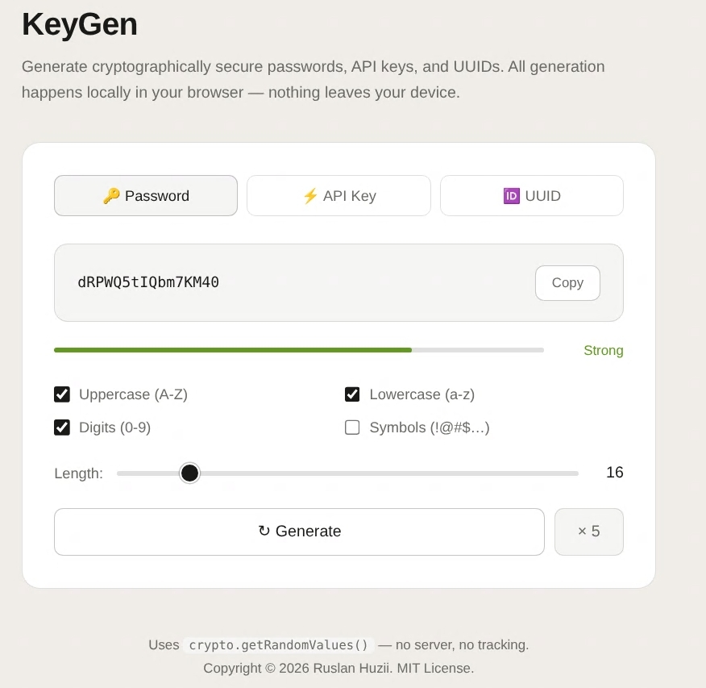
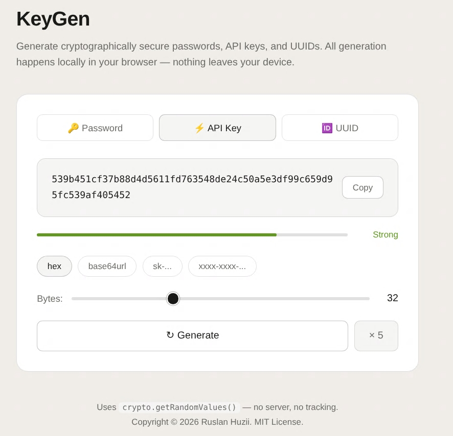
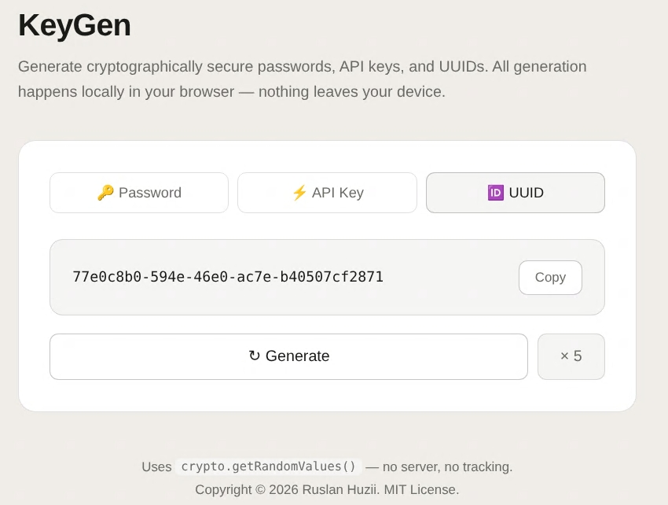

# 🔑 KeyGen

> Cryptographically secure password, API key, and UUID generator — fully client-side.

[](https://nextjs.org/)
[](https://react.dev/)
[](https://www.typescriptlang.org/)
[](https://tailwindcss.com/)
[](LICENSE)

---

## ✨ Features

- **🔑 Password Generator** — configurable length (8–64 chars), uppercase, lowercase, digits, symbols, real-time strength indicator
- **⚡ API Key Generator** — four formats: `hex`, `base64url`, `sk-...` (OpenAI/Stripe style), `xxxx-xxxx-...` (segmented)
- **🆔 UUID v4** — RFC 4122 compliant universally unique identifiers
- **📋 Batch Mode** — generate 5 variants at once with one-click copy per item
- **🌙 Dark Mode** — follows system `prefers-color-scheme` automatically
- **🔒 100% Client-Side** — all entropy from `crypto.getRandomValues()`, nothing leaves your browser

---


## 📸 Screenshots

### Password Generator



### API Key Generator



### UUID Generator



---

## 🚀 Getting Started

### Prerequisites

- [Node.js](https://nodejs.org/) v18.18 or later
- npm v9 or later

### Installation

```bash
# Clone the repository
git clone https://github.com/rguziy/keygen.git
cd keygen

# Install dependencies
npm install

# Start the development server
npm run dev
```

Open [http://localhost:3000](http://localhost:3000) in your browser.

---

## 📦 Build & Deploy

```bash
# Production build
npm run build

# Start production server
npm start
```

The app can be deployed to any platform that supports Next.js — [Vercel](https://vercel.com/), [Netlify](https://netlify.com/), or a self-hosted Node.js server.

---

## 🐳 Docker

You can build and run KeyGen using Docker.

### Build Docker Image

```bash
docker build -t keygen .
```

### Run Container

```bash
docker run -p 3000:3000 keygen
```

Then open:

```text
http://localhost:3000
```

### Run in Detached Mode

```bash
docker run -d -p 3000:3000 --name keygen keygen
```

### Stop Container

```bash
docker stop keygen
```

### Remove Container

```bash
docker rm keygen
```
---

## 🗂️ Project Structure

```
keygen/
├── src/
│   ├── app/
│   │   ├── layout.tsx        # Root layout & metadata
│   │   ├── page.tsx          # Home page
│   │   └── globals.css       # CSS variables, dark mode, global styles
│   ├── components/
│   │   ├── KeyGen.tsx        # Main generator UI (all three modes)
│   │   ├── StrengthBar.tsx   # Animated password strength indicator
│   │   └── CopyButton.tsx    # Reusable copy-to-clipboard button
│   └── lib/
│       └── crypto.ts         # Pure generation functions (password, API key, UUID)
├── tailwind.config.ts
├── tsconfig.json
└── package.json
```

---

## 🛠️ Tech Stack

| Technology | Purpose |
|---|---|
| [Next.js 15](https://nextjs.org/) | React framework (App Router) |
| [React 19](https://react.dev/) | UI library |
| [TypeScript 5](https://www.typescriptlang.org/) | Type safety |
| [Tailwind CSS 3](https://tailwindcss.com/) | Utility-first styling |
| [Web Crypto API](https://developer.mozilla.org/en-US/docs/Web/API/Web_Crypto_API) | Cryptographically secure RNG |

---

## 🔐 Security

All key generation is performed **entirely in the browser** using the [Web Crypto API](https://developer.mozilla.org/en-US/docs/Web/API/Crypto/getRandomValues) (`crypto.getRandomValues()`). No data is sent to any server, no analytics, no tracking.

---

## 📄 License

This project is licensed under the MIT License. See [LICENSE](./LICENSE).
Copyright © 2026 Ruslan Huzii

---

<p align="center">Built with ❤️ using Next.js & the Web Crypto API</p>